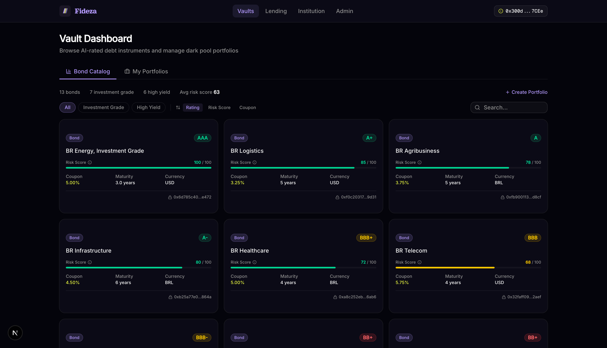
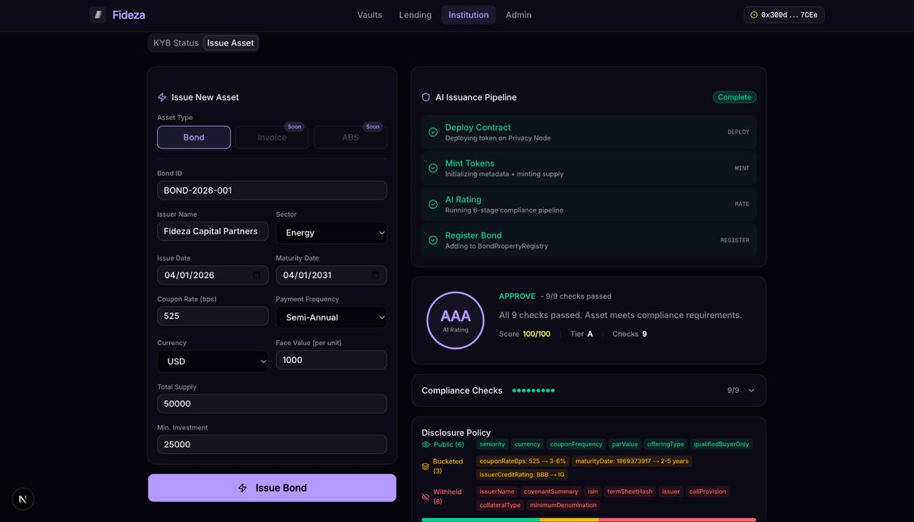
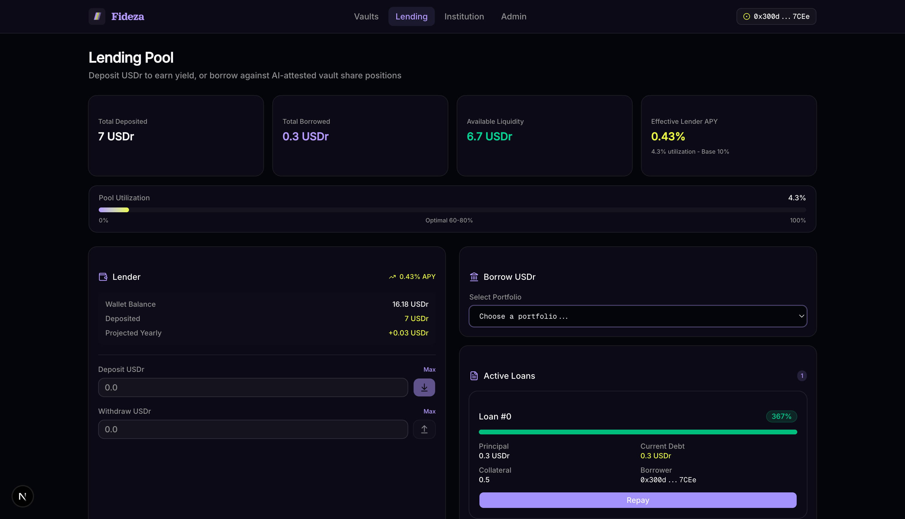

# Fideza — AI-Rated Private Credit Protocol

**Fideza** is a private credit protocol built on [Rayls](https://rayls.com) where institutions privately issue debt instruments (corporate bonds, ABS tranches, invoices), an AI agent rates them using a public, cryptographically-attested methodology, and end users can invest in AI-constructed custom portfolios of rated debt, deployed as vaults with tokenized shares. A lending pool enables vault share holders to borrow USDr against their illiquid positions.

---

## Three Layers

### Layer 1: Private Issuance + AI Rating

Institutions issue bonds on the Privacy Node with full private metadata (financials, exact coupon rates, covenant terms). The AI Rating Agent reads this private data, applies a deterministic + LLM-powered compliance methodology, and produces a credit rating (AAA through CCC). The rating is ECDSA-signed and attested on-chain. Only bucketed, privacy-preserving properties cross to the public chain — exact terms stay private.

**6-stage pipeline:** `READ → VALIDATE → ANALYZE → DISCLOSE → REPORT → ATTEST`

- **Deterministic checks:** KYB verification, jurisdiction screening, sanctions, schema completeness, value limits, maturity range, credit rating validation
- **LLM analysis:** Covenant quality assessment (bonds), payment terms analysis (invoices), pool composition evaluation (ABS)
- **Privacy-preserving disclosure:** AI auto-categorizes each metadata field as Public, Bucketed (e.g., coupon 5.75% → "3-6%"), or Withheld (e.g., issuer name)
- **On-chain attestation:** ECDSA-signed report hash stored in ComplianceStore

### Layer 2: AI Portfolio Construction (Dark Pool) + ZK Proofs

Users specify investment constraints ("BBB-AA, ~7% yield, max diversification") and an investment amount in USDr. The AI Portfolio Agent constructs an optimal portfolio from the rated bond universe:

**7-stage pipeline:** `PARSE → SCAN → OPTIMIZE → CONSTRUCT → ATTEST → BRIDGE → ZK PROVE`

- **LLM optimization** (Gemini 2.5 Flash): Proposes weight allocations based on yield targets, risk tolerance, diversification, and maturity preferences
- **Greedy fallback:** Deterministic equal-weight allocation if LLM output fails validation
- **Dark pool:** Portfolio vault holds actual bond tokens on Privacy Node. Composition stays private. Only aggregate metrics (total value, yield, diversification score, rating range) are attested on the public chain
- **Vault shares:** ERC-20 tokens representing portfolio ownership, bridged to public chain via Rayls teleport
- **ZK proof (Noir + UltraHonk):** Cryptographic proof that the portfolio's claimed aggregate metrics are correct — without revealing which bonds are held

#### Zero-Knowledge Portfolio Proofs

The system uses **Noir circuits** with the **UltraHonk** proving system (Barretenberg backend) to generate trustless proofs of portfolio composition.

**What's proven (without revealing individual holdings):**

| Public Claim | Constraint Verified |
|---|---|
| Total value | Sum of all bond amounts matches claimed total |
| Weighted yield | Floor-accurate weighted average of coupon rates |
| Bond count | Number of active (non-zero) positions |
| Rating range | Min/max ratings are tight (at least one bond at each bound) |
| Max exposure | Largest single position weight matches claim |
| Diversification score | HHI-based score: `10 - floor(sum(w_i²) / 10,000,000)` |
| Weight integrity | All weights sum to exactly 10,000 bps (100%) |

**Private inputs (never revealed):** per-bond amounts, weights, coupon rates, and rating indices for up to 8 bond slots.

**Proof flow:**
```
Agent reads vault composition from Privacy Node →
computes claimed aggregates → writes Prover.toml →
nargo compile → nargo execute → bb prove (evm-no-zk) →
proof bytes sent to client → user submits verifyAndStore() on-chain
```

**Two verification methods** — users can verify portfolios via AI attestation (ECDSA signature, trusted) or ZK proof (cryptographic, trustless). Both implement the same `IPortfolioVerifier` interface.

### Layer 3: Lending Pool

Vault share holders can borrow USDr against their illiquid portfolio positions:

- **150% collateral ratio** — overcollateralized lending
- **10% APY** for lenders who deposit USDr
- **120% liquidation threshold** — anyone can liquidate undercollateralized positions
- **AI verification** — lending pool verifies portfolio attestation signature before accepting collateral

---

## Agentic Asset Issuance

Institutions issue new debt instruments through an AI-powered pipeline that deploys, mints, rates, and registers assets in a single flow:

**4-stage pipeline:** `DEPLOY → MINT → RATE → REGISTER`

1. Deploys a new token contract (BondToken/InvoiceToken/ABSToken) on the Privacy Node
2. Initializes with full metadata and mints token supply
3. Runs the complete 6-stage AI compliance pipeline — deterministic rules + LLM analysis
4. Assigns credit rating (AAA-CCC) and registers in BondPropertyRegistry for portfolio inclusion

---

## Architecture

```
Privacy Node (Gasless)                          Public Chain (USDr Gas)
================================                ================================
InstitutionRegistry (KYB)                       BondCatalog (rated properties)
ComplianceStore (AI attestations)               PortfolioAttestation (aggregate metrics)
DisclosureGate (governance)                     AIAttestationVerifier
BondPropertyRegistry (full data)                FidezaLendingPool (10% APY)
PortfolioVault (dark pool)                      VaultShareToken mirrors
BondToken / InvoiceToken / ABSToken
VaultShareToken (bridgeable)

        AI Agent Server (port 3001)
        ├── Rating Pipeline (compliance)
        ├── Portfolio Pipeline (construction)
        └── Issuance Pipeline (deploy + rate)
```

**Privacy guarantees:**
- Bond tokens never leave the Privacy Node
- Portfolio composition is a dark pool — only aggregate metrics are public
- Exact coupon rates, issuer names, covenant terms are withheld or bucketed
- AI reads private data, outputs only ratings + aggregates

---

## Tech Stack

| Layer | Technology |
|-------|-----------|
| Smart Contracts | Solidity 0.8.24, Foundry, OpenZeppelin |
| AI Agent | TypeScript, ethers.js, OpenRouter (Gemini 2.5 Flash) |
| Frontend | Next.js 16, Tailwind v4, shadcn/ui, wagmi v3, viem |
| Wallet | Privy (embedded wallet) |
| Privacy | Rayls Privacy Node + Public Chain |
| Bridge | RaylsErc20Handler (teleportToPublicChain) |

---

## Key Flows

### Institution Issues a Bond
```
Admin approves institution (KYB) → Institution fills bond details →
AI Agent deploys contract → mints tokens → runs 9 compliance checks →
LLM analyzes covenants → assigns AAA rating → registers in catalog
```

### User Invests in AI Portfolio
```
User deposits 10 USDr → specifies constraints (rating, yield, risk) →
AI scans 12+ rated instruments → LLM optimizes allocation →
creates on-chain vault → deploys share token → signs attestation →
bridges shares to user's wallet on public chain
```

### User Borrows Against Portfolio
```
User deposits vault shares as collateral → lending pool verifies
AI attestation signature → user borrows USDr at 10% APY →
if collateral ratio drops below 120% → liquidation triggered
```

---

## AI Agents

### Rating Agent
- **Input:** Full private metadata from Privacy Node
- **Checks:** KYB verification, jurisdiction/sanctions screening, schema validation, value limits, maturity range, credit rating validity, LLM covenant/payment/pool analysis
- **Output:** Risk score (0-100), credit rating (AAA-CCC), recommendation (APPROVE/REJECT/ESCALATE), ECDSA-signed attestation
- **Privacy:** Only the rating + bucketed properties are disclosed. Raw financials stay private.

### Portfolio Agent
- **Input:** User constraints (rating range, yield target, risk tolerance, investment amount)
- **Optimization:** Gemini 2.5 Flash proposes weight allocations, validated against hard constraints (weight sum = 10000 bps, max exposure, min bonds, asset type diversity)
- **Output:** On-chain vault with bond tokens, share token bridged to public chain, signed attestation of aggregate metrics
- **Privacy:** Portfolio composition is a dark pool. Only aggregate metrics (yield, diversification, rating range) are public.

---

## Screenshots

### Bond Catalog — AI-rated debt instruments with filtering


### AI Issuance Pipeline — Deploy, mint, rate, register in one flow


### Lending Pool — Deposit USDr, borrow against vault shares


---

## Getting Started

### Prerequisites

- [Bun](https://bun.sh) (for client)
- [Node.js 20+](https://nodejs.org) + npm (for contracts & agent)
- [Foundry](https://book.getfoundry.sh/getting-started/installation) (for contract deployment)
- [Noir](https://noir-lang.org/docs/getting_started/installation/) + [Barretenberg](https://github.com/AztecProtocol/barretenberg) (`bb`) (for ZK proofs)

### 1. Clone & Install

```bash
git clone https://github.com/narasim-teja/fideza
cd fideza

# Client
cd client && bun install

# Agent
cd ../contracts/agent && npm install

# Contracts
cd .. && forge install
```

### 2. Environment Variables

Copy the example files and fill in your values:

```bash
cp client/.env.example client/.env.local
cp contracts/.env.example contracts/.env
cp contracts/agent/.env.example contracts/agent/.env
```

#### Client (`client/.env.local`)

| Variable | Description |
| --- | --- |
| `NEXT_PUBLIC_PRIVY_APP_ID` | Privy App ID from [dashboard.privy.io](https://dashboard.privy.io) |

#### Agent (`contracts/agent/.env`)

| Variable | Required | Description |
| --- | --- | --- |
| `PRIVACY_NODE_RPC_URL` | Yes | Rayls Privacy Node RPC (from hackathon organizers) |
| `PUBLIC_CHAIN_RPC_URL` | No | Defaults to `https://testnet-rpc.rayls.com` |
| `AGENT_PRIVATE_KEY` | Yes | AI agent wallet private key |
| `DEPLOYER_PRIVATE_KEY` | Yes | Wallet that deploys token contracts |
| `AI_PROVIDER` | No | `openrouter` (default), `gemini`, `anthropic`, `openai` |
| `OPENROUTER_API_KEY` | Yes* | API key from [openrouter.ai](https://openrouter.ai/keys) |
| `OPENROUTER_MODEL` | No | Defaults to `auto` (tries free models) |
| `PORT` | No | Agent server port, defaults to `3001` |

*Required if using OpenRouter (default). Swap for `GEMINI_API_KEY`, `ANTHROPIC_API_KEY`, or `OPENAI_API_KEY` based on your `AI_PROVIDER`.

Contract addresses (`INSTITUTION_REGISTRY_ADDRESS`, `COMPLIANCE_STORE_ADDRESS`, etc.) are set after deployment — see deployed contracts below.

#### Contracts (`contracts/.env`)

| Variable | Required | Description |
| --- | --- | --- |
| `PRIVACY_NODE_RPC_URL` | Yes | Rayls Privacy Node RPC |
| `DEPLOYMENT_PROXY_REGISTRY` | Yes | Rayls deploy proxy address |
| `DEPLOYER_PRIVATE_KEY` | Yes | Deployer wallet private key |
| `PUBLIC_CHAIN_ID` | No | Defaults to `7295799` |

### 3. Run

```bash
# Start the client (Next.js)
cd client && bun dev

# Start the agent server (separate terminal)
cd contracts/agent && npm run server
```

---

## Deployed Contracts

**Explorers:**
- Public Chain: [testnet-explorer.rayls.com](https://testnet-explorer.rayls.com)
- Privacy Node: [blockscout-privacy-node-1.rayls.com](https://blockscout-privacy-node-1.rayls.com)

### Privacy Node

> Explorer: [blockscout-privacy-node-1.rayls.com](https://blockscout-privacy-node-1.rayls.com)

| Contract | Address |
| --- | --- |
| InstitutionRegistry | [0x6d77…Cf86](https://blockscout-privacy-node-1.rayls.com/address/0x6d777B7833Ffc0D7761cd218AE3b44d290CFCf86) |
| ComplianceStore | [0x6adF…F6C4](https://blockscout-privacy-node-1.rayls.com/address/0x6adF0665e7aFa93a9CF20749e7c6e09efd9cF6C4) |
| DisclosureGate | [0x36C5…Fca](https://blockscout-privacy-node-1.rayls.com/address/0x36C508b13B5a9509eB0E8d9F173Ba886961bcFca) |
| BondPropertyRegistry | [0x8Be2…BE57](https://blockscout-privacy-node-1.rayls.com/address/0x8Be2836F85949181758B137caB58792621F1BE57) |
| PortfolioVault | [0x4Ba6…0F43](https://blockscout-privacy-node-1.rayls.com/address/0x4Ba623e2D23AE801F32a9e4f0FdDa1A06cF50F43) |
| VaultShareToken | [0x796d…6A6C](https://blockscout-privacy-node-1.rayls.com/address/0x796dcE09cE2566f5536D395906E2F2063e676A6C) |

**Issued Tokens (Privacy Node):**

| Token | Type | Address |
| --- | --- | --- |
| BR Energy | Bond | [0x6190…DAa0](https://blockscout-privacy-node-1.rayls.com/address/0x6190c422A69819bD9b33A2e5d8B415C4aD54DAa0) |
| BR Telecom | Bond | [0x4D16…8208](https://blockscout-privacy-node-1.rayls.com/address/0x4D16ed08cE537365a5FcAe19931aBE7304c18208) |
| BR Infrastructure | Bond | [0x7128…97A8](https://blockscout-privacy-node-1.rayls.com/address/0x71280A0D6C104958001BfB12Ad2dc69f09BC97A8) |
| BR Bank | Bond | [0xe3D1…8f0](https://blockscout-privacy-node-1.rayls.com/address/0xe3D1b1836cb5F8779F2197c703E6075AD39578f0) |
| BR Mining | Bond | [0x2bdb…D16a](https://blockscout-privacy-node-1.rayls.com/address/0x2bdb3Ab2416a1F9778029838663d02D52eadD16a) |
| BR Retail | Bond | [0xD4C1…8483](https://blockscout-privacy-node-1.rayls.com/address/0xD4C13c74955B7A712B8Ee2Fbc99E2A62430f8483) |
| Cargill | Invoice | [0x8182…dAF7B](https://blockscout-privacy-node-1.rayls.com/address/0x81826B98B59f6e4d751CA0ac4521302D17bdAF7B) |
| TOTVS | Invoice | [0x2286…56b8](https://blockscout-privacy-node-1.rayls.com/address/0x22860a780C39B4aC32D88b378c39979650db56b8) |
| Mortgage Pool | ABS | [0xf3b4…2039](https://blockscout-privacy-node-1.rayls.com/address/0xf3b47CFB1b11d7Bd42671A170DBD9B3067b82039) |
| Credit Pool | ABS | [0xB727…00E3](https://blockscout-privacy-node-1.rayls.com/address/0xB727EE4A60f8bafa1814C165e5035e61B66600E3) |

### Public Chain (Chain ID: 7295799)

> Explorer: [testnet-explorer.rayls.com](https://testnet-explorer.rayls.com)

| Contract | Address |
| --- | --- |
| BondCatalog | [0x4071…aaC0](https://testnet-explorer.rayls.com/address/0x40713c6040eA8E4c6a88897cf70A5e789553aaC0) |
| PortfolioAttestation | [0xAc7E…5855](https://testnet-explorer.rayls.com/address/0xAc7E7F211594c1e25a88B0Ca8C2824a5d0315855) |
| AIAttestationVerifier | [0x6adF…F6C4](https://testnet-explorer.rayls.com/address/0x6adF0665e7aFa93a9CF20749e7c6e09efd9cF6C4) |
| ZKPortfolioVerifier | [0x60A1…3dA4](https://testnet-explorer.rayls.com/address/0x60A1c66c6C308Afb003769CD35fACF5f593B3dA4) |
| FidezaLendingPool | [0xCFe8…D1](https://testnet-explorer.rayls.com/address/0xCFe85abB69E13876d7de9Dd5427Bf61c51Cb61D1) |


---

## Project Structure

```
fideza/
├── client/                 # Next.js 16 frontend (Privy, wagmi, shadcn/ui)
├── contracts/
│   ├── src/                # Solidity contracts (Foundry)
│   ├── script/             # Deployment scripts
│   └── agent/              # AI agent server (TypeScript)
│       └── src/
│           ├── server.ts           # HTTP API (port 3001)
│           ├── compliance/         # Rating pipeline
│           ├── portfolio/          # Portfolio + ZK proof pipeline
│           └── issuance/           # Agentic asset issuance
└── circuits/
    └── portfolio_proof/    # Noir ZK circuit
        └── src/main.nr     # Circuit logic (8 assertions)
```
